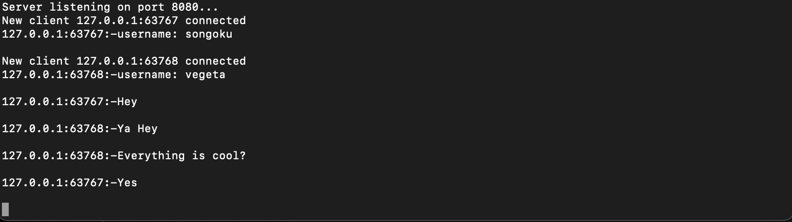
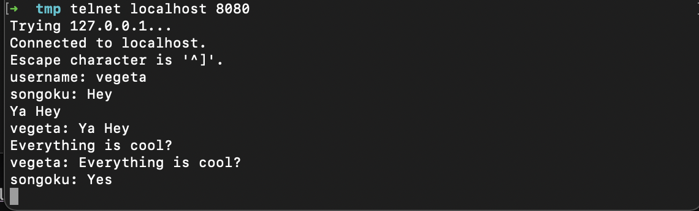

### Rust simple telnet chat
A simple telnet chat using Rust for educational purpose

### Features
- Multiple users can join a single chat
- Users can have nickname
- If username is not specified, the username will be `client-i` when i is an increasing number

### How to run
- Run chat server by `cargo run`
- Open a terminal with telnet client installed and run `telnet ip 8080` ip = localhost if client is on
  the same machine with server , for example `telnet 192.168.1.20 8080`
- Start chatting
- Change nickname by typing: `username: your-user-name`, for example `username: songoku`

### Architecture